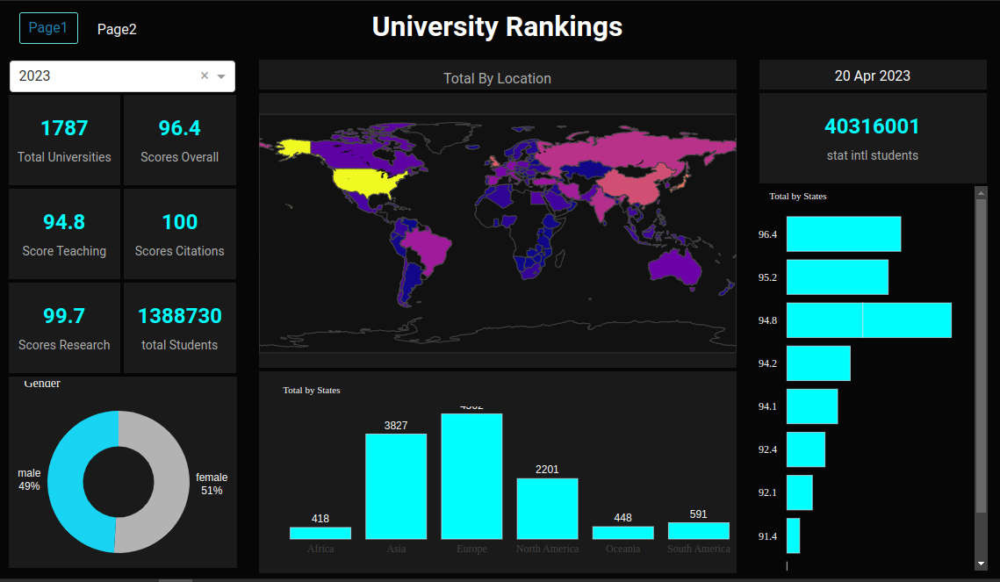

# HEALTH CARE DASHBOARD



## Data Source

The THE World University Rankings provide the definitive list of the world’s best universities, with an emphasis on the research mission. It is the only global university league table to judge research-intensive universities across all of their core missions: teaching (the learning environment); research (volume, income and reputation); citations (research influence); industry income (knowledge transfer) and international outlook (staff, students and research). It uses 13 carefully calibrated performance indicators to provide the most comprehensive and balanced comparisons. The overall list is accompanied by 11 subject-specific rankings.

### Run Locally


1. Create a folder dashboard.
2. Open terminal and cd in dashboard.

```bash
# clone the repo
git clone https://github.com/Sachimugu/Health-care-dasboard.git
```

```bash
# Create a conda virtual environment called healthCaerDashboard and install all the packages
conda create --name healthCaerDashboard pandas plotly plotly dash==2.5.1 dash-bootstrap-components
```

```bash
# Activate the conda environment
conda activate healthCaerDashboard
```

```bash
#run app
python dashboard.py
```

Go to http://127.0.0.1:8081/ on browser

### Contact

<a href="mailto:sachiimugu@gmail.com">  </a>

<a href="https://www.linkedin.com/in/achimugu-a-79aa8a18a/">  </a>
<a href="https://twitter.com/achimugu_a">  </a>
<a href="https://medium.com/@sachimugu">  </a>
