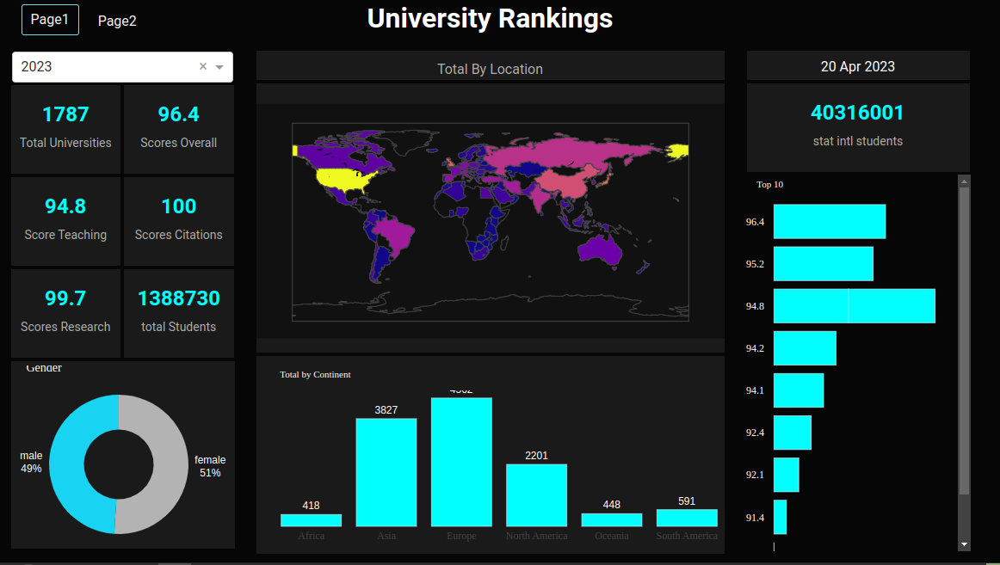

# Data Story



# DashBoard Link: https://unirankings.onrender.com/

## Data Source

The THE World University Rankings provide the definitive list of the world’s best universities, with an emphasis on the research mission. It is the only global university league table to judge research-intensive universities across all of their core missions: teaching (the learning environment); research (volume, income and reputation); citations (research influence); industry income (knowledge transfer) and international outlook (staff, students and research). It uses 13 carefully calibrated performance indicators to provide the most comprehensive and balanced comparisons. The overall list is accompanied by 11 subject-specific rankings.

## Thougth process

- Step 1. Get data from sources
- Step 2. Inspect and clean data for homogenecity
- Step 3. Exploratory data analysis to gain insight
- Step 4. Visualize data with seaborn
- Step 5. Build a dasboard with Plotly Dash
- Step 6. deploy dashboard on Rnder.com free tier
- Step 7. make a ppt slide with powerpoint

## Library Used For Visualisation

https://youtu.be/eRwxOqaP3tI

- PLotly and PlotlyDash
- Seaborn
- Matplotlib
- Other libraries can be found in 

### Watch the Video

[](https://youtu.be/eRwxOqaP3tI)

### Run Locally

1. Create a folder dashboard.
2. Open terminal and cd in dashboard.

```bash
# clone the repo
git clone https://github.com/Sachimugu/Universitity-Ranking
```

```bash
# Activate the conda environment
cd Dashboard
```

```bash
# Create a conda virtual environment called healthCaerDashboard and install all the packages
pip install -r requirments.txt
```

```bash
#run app
python app.py
```

### Contact

<a href="mailto:sachiimugu@gmail.com">  </a>

<a href="https://www.linkedin.com/in/sachimugu/">  </a>
<a href="https://twitter.com/achimugu_a">  </a>
